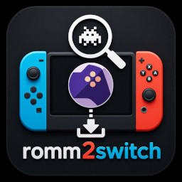

# RomM2Switch

A Nintendo Switch homebrew application (NRO) that connects to your self-hosted
[RomM](https://github.com/rommapp/romm) installation and lets you browse and
download ROMs directly to your SD card.

<div align="center">

</div>

---

## Features

| Feature | Details |
|---|---|
| 🎮 Browse Platforms | Scroll through all platforms in your RomM library |
| 🗂️ Browse Collections | View and open any collection |
| 🔍 Search ROMs | In-list search / filter by typing |
| ℹ️ ROM Details | See file name, size, platform, region, and summary |
| ⬇️ Download | Download ROMs to `sdmc:/roms/<platform>/` with a live progress bar |
| ⚙️ Settings | Configure server URL, credentials, and download path — stored on SD card |

---

## Requirements

- Nintendo Switch with **Custom Firmware** (Atmosphère or similar)
- A running [RomM](https://github.com/rommapp/romm) instance (Version 4.7.0) reachable from
  your local network (HTTP or HTTPS; self-signed certificates are accepted)

---

## Pre-built Releases
Download the latest release from [GitHub Releases](https://github.com/PeriBluGaming/romm2switch/releases/latest)


## Building from Source

### Prerequisites

Install [devkitPro](https://devkitpro.org/wiki/Getting_Started) and then
install the required Switch portlibs:

```sh
dkp-pacman -S switch-dev switch-sdl2 switch-sdl2_ttf \
              switch-curl switch-mbedtls \
              switch-libpng switch-libjpeg-turbo switch-libwebp \
              switch-zlib switch-bzip2 switch-freetype
```

### Build

```sh
make
```

This produces `romm2switch.nro`.

### Icon

Place a 256×256 pixel JPEG named `icon.jpg` in the project root before
building to embed it in the NRO.

---

## Building with Docker

If you don't want to install devkitPro locally, you can use Docker:

### Icon

Place a 256×256 pixel JPEG named icon.jpg in the project root before building to embed it in the NRO.

```bash
docker build -t romm2switch .
docker run --rm -v $(pwd):/build romm2switch make
```

---

## Installation

1. Copy `romm2switch.nro` to `sdmc:/switch/romm2switch/` on your Switch SD card.
2. Launch it from the Homebrew Menu (hbmenu).

---

## First-Run Configuration

On first launch, select **Settings** from the main menu and fill in:

| Field | Example |
|---|---|
| **Server URL** | `http://192.168.1.100:3000` |
| **Username** | `admin` |
| **Password** | `your-password` |
| **Download Path** | `sdmc:/roms/` (default) |

Press **X** to save.  The configuration is stored at
`sdmc:/config/romm2switch/config.json`.

---

## Controls

| Button | Action |
|---|---|
| ↑ / ↓ | Navigate list |
| A / Enter | Select / Confirm / Start editing |
| B | Back |
| X | Download ROM (on detail screen) / Save settings |
| Y | Open search / filter (on game list screen) |

> **Note:** The Switch SDL2 port maps Joy-Con / Pro Controller buttons to
> keyboard key codes automatically. The mapping is:
> A → Enter, B → B, X → X, Y → Y, D-Pad → Arrow keys.

---

## Download Path

ROMs are saved to:

```
<Download Path>/<platform-slug>/<rom-file-name>
```

For example: `sdmc:/roms/snes/Super Mario World.sfc`

---

## API Compatibility

Tested against **RomM v3.x / v4.x**.  Authentication uses **HTTP Basic Auth** — credentials are sent with every request (no login endpoint required).

The following endpoints are used:

| Method | Endpoint | Purpose |
|---|---|---|
| GET | `/api/platforms` | List platforms (also used to validate credentials) |
| GET | `/api/roms?platform_ids={id}&limit={n}` | List ROMs for a platform |
| GET | `/api/collections` | List collections |
| GET | `/api/collections/{id}/roms?limit={n}` | List ROMs in a collection |
| GET | `/api/roms/{id}` | ROM details |
| GET | `/api/roms/{id}/content/{filename}` | Download ROM file |

---

## License

GNU General Public License v3.0 - See [LICENSE](LICENSE) for details.

## Contributing & Forking

If you fork this project, please:
- ✅ Add a note in your README: "Based on [romm2switch](https://github.com/PeriBluGaming/romm2switch) by PeriBluGaming"
- ✅ Clearly document your changes