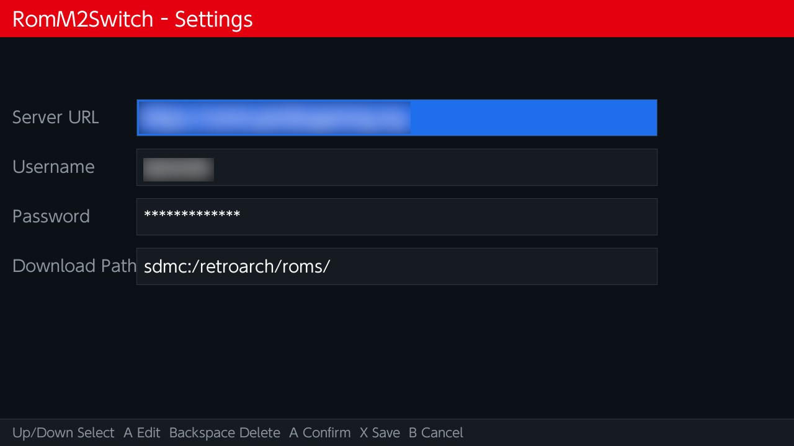
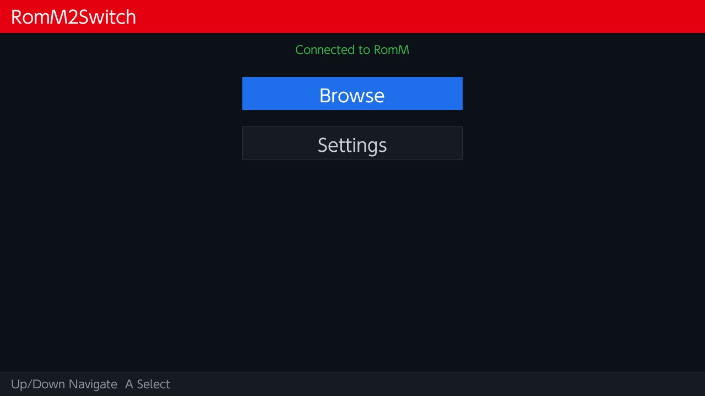
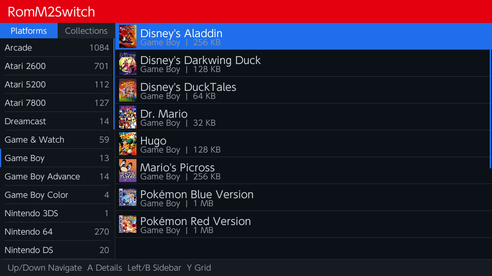
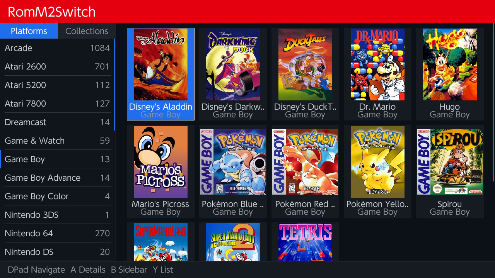
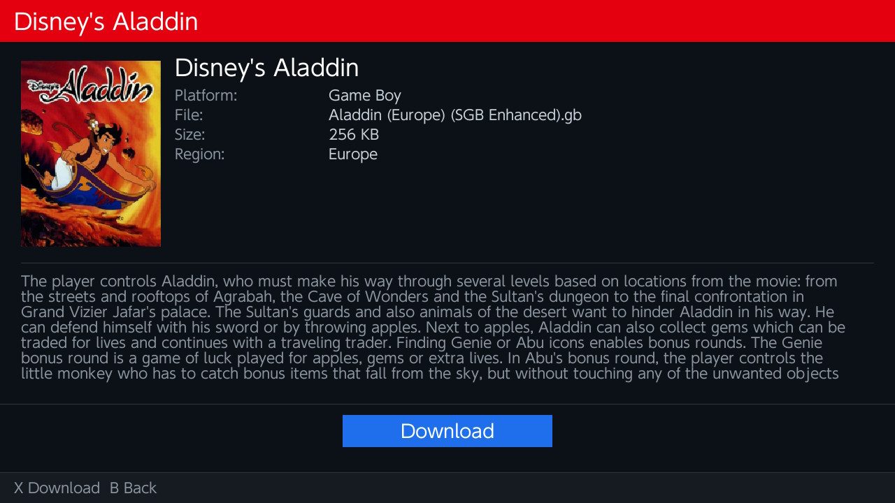

# RomM2Switch — Benutzeranleitung

Diese Anleitung beschreibt, wie du **RomM2Switch** auf deiner Nintendo Switch installierst, einrichtest und verwendest.

---

## Inhaltsverzeichnis

1. [Voraussetzungen](#voraussetzungen)
2. [Installation](#installation)
3. [Ersteinrichtung (Settings)](#ersteinrichtung-settings)
4. [Anwendung starten](#anwendung-starten)
5. [Plattformen & Sammlungen durchsuchen](#plattformen--sammlungen-durchsuchen)
6. [Listen- und Rasteransicht](#listen--und-rasteransicht)
7. [ROM-Details anzeigen](#rom-details-anzeigen)
8. [ROMs herunterladen](#roms-herunterladen)
9. [Steuerung (Controls)](#steuerung-controls)
10. [Konfigurationsdatei](#konfigurationsdatei)
11. [Download-Pfad](#download-pfad)
12. [API-Kompatibilität](#api-kompatibilität)
13. [Fehlerbehebung](#fehlerbehebung)

---

## Voraussetzungen

Bevor du RomM2Switch nutzen kannst, stelle sicher, dass Folgendes vorhanden ist:

| Voraussetzung | Beschreibung |
|---|---|
| **Custom Firmware** | Deine Nintendo Switch muss eine Custom Firmware wie [Atmosphère](https://github.com/Atmosphere-NX/Atmosphere) installiert haben. |
| **RomM-Server** | Du benötigst eine laufende [RomM](https://github.com/rommapp/romm)-Instanz (empfohlen: Version 4.7.0), die über dein lokales Netzwerk erreichbar ist (HTTP oder HTTPS). Selbst-signierte Zertifikate werden akzeptiert. |
| **Netzwerkverbindung** | Die Switch muss sich im selben Netzwerk wie dein RomM-Server befinden (WLAN). |

---

## Installation

1. Lade die neueste Version von `romm2switch.nro` von der [GitHub Releases-Seite](https://github.com/PeriBluGaming/romm2switch/releases/latest) herunter.
2. Kopiere die Datei `romm2switch.nro` auf die SD-Karte deiner Switch in folgendes Verzeichnis:
   ```
   sdmc:/switch/romm2switch/romm2switch.nro
   ```
3. Stecke die SD-Karte zurück in die Switch (falls entfernt).
4. Starte das **Homebrew Menu** (hbmenu) auf deiner Switch.
5. Wähle **RomM2Switch** aus der Liste der Homebrew-Apps.

---

## Ersteinrichtung (Settings)

Beim ersten Start musst du die Verbindung zu deinem RomM-Server einrichten.

### Schritt-für-Schritt

1. Starte RomM2Switch über das Homebrew Menu.
2. Wähle im Hauptmenü den Punkt **Settings** aus.

   

3. Fülle die folgenden Felder aus:

| Feld | Beschreibung | Beispiel |
|---|---|---|
| **Server URL** | Die vollständige URL deines RomM-Servers inkl. Port. | `http://192.168.1.100:3000` |
| **Username** | Dein RomM-Benutzername. | `admin` |
| **Password** | Dein RomM-Passwort. | `dein-passwort` |
| **Download Path** | Der Pfad auf der SD-Karte, wohin ROMs gespeichert werden sollen. | `sdmc:/roms/` (Standard) |

4. Navigiere mit **↑ / ↓** zwischen den Feldern.
5. Drücke **A** um ein Feld zum Bearbeiten auszuwählen und gib den Wert über die Bildschirmtastatur ein.
6. Drücke **X** um die Einstellungen zu speichern.

> **Tipp:** Wenn du den Download-Pfad leer lässt, wird automatisch `sdmc:/roms/` verwendet.

---

## Anwendung starten

Nach der Ersteinrichtung verbindet sich RomM2Switch automatisch mit deinem RomM-Server.

1. Starte RomM2Switch über das Homebrew Menu.

   

2. Die App prüft deine gespeicherten Zugangsdaten und verbindet sich mit dem Server.
3. Bei erfolgreicher Verbindung gelangst du direkt zum **Browse-Bildschirm**.
4. Falls die Verbindung fehlschlägt, wird eine Fehlermeldung angezeigt. Überprüfe in diesem Fall deine Einstellungen.

---

## Plattformen & Sammlungen durchsuchen

Der Browse-Bildschirm ist in zwei Bereiche aufgeteilt:

- **Sidebar (links):** Zeigt entweder Plattformen oder Sammlungen an.
- **Inhaltsbereich (rechts):** Zeigt die ROMs der ausgewählten Plattform oder Sammlung.

### Plattformen

Plattformen entsprechen den Spieleplattformen, die in deinem RomM-Server konfiguriert sind (z. B. SNES, N64, Game Boy Advance usw.).

### Sammlungen

Sammlungen sind benutzerdefinierte Gruppierungen von ROMs, die du in RomM erstellt hast.

### Zwischen Plattformen und Sammlungen wechseln

Drücke **L** oder **R** um zwischen den Tabs **Platforms** und **Collections** zu wechseln.

### Navigation

- Verwende **↑ / ↓** um in der Sidebar zu scrollen.
- Drücke **→** um in den Inhaltsbereich zu wechseln.
- Drücke **←** um zurück zur Sidebar zu gelangen.

---

## Listen- und Rasteransicht

Der Inhaltsbereich kann in zwei Ansichtsmodi dargestellt werden:

### Listenansicht (List View)



- Zeigt ROMs als vertikale Liste mit Namen und Zusatzinfos an.
- Neben jedem Eintrag wird ein kleines Cover-Bild angezeigt (falls vorhanden).

### Rasteransicht (Grid View)



- Zeigt ROMs als Kacheln mit Cover-Bildern an.
- Ideal zum visuellen Durchstöbern größerer Sammlungen.

### Ansicht umschalten

Drücke **Y** um zwischen Listen- und Rasteransicht zu wechseln.

---

## ROM-Details anzeigen

1. Navigiere im Inhaltsbereich zu einem ROM.
2. Drücke **A** um die Detailansicht zu öffnen.



Die Detailansicht zeigt folgende Informationen:

| Information | Beschreibung |
|---|---|
| **Cover-Bild** | Das Cover des Spiels (links). |
| **Dateiname** | Der Name der ROM-Datei. |
| **Dateigröße** | Die Größe der ROM-Datei (KB, MB, GB). |
| **Plattform** | Die zugehörige Plattform. |
| **Region** | Die Region(en) des ROMs (z. B. USA, Europe, Japan). |
| **Beschreibung** | Eine Zusammenfassung / Beschreibung des Spiels (falls vorhanden). |

Drücke **B** um zurück zur ROM-Liste zu gelangen.

---

## ROMs herunterladen

1. Öffne die Detailansicht eines ROMs (siehe oben).
2. Drücke **X** um den Download zu starten.
3. Ein Fortschrittsbalken zeigt den Download-Fortschritt an.
4. Nach Abschluss wird das ROM im konfigurierten Download-Pfad gespeichert.

### Speicherort

ROMs werden nach folgendem Schema gespeichert:

```
<Download-Pfad>/<plattform-slug>/<rom-dateiname>
```

**Beispiel:**
```
sdmc:/roms/snes/Super Mario World.sfc
```

> **Hinweis:** Falls der Ordner für die Plattform noch nicht existiert, wird er automatisch erstellt.

---

## Steuerung (Controls)

Die folgende Tabelle zeigt alle Steuerungsmöglichkeiten:

| Taste | Aktion |
|---|---|
| **↑ / ↓** | In Listen navigieren (Sidebar, ROM-Liste) |
| **← / →** | Zwischen Sidebar und Inhaltsbereich wechseln |
| **A** | Auswählen / Bestätigen / Feld bearbeiten |
| **B** | Zurück / Zur Sidebar zurückkehren |
| **X** | ROM herunterladen (Detailansicht) / Einstellungen speichern |
| **Y** | Zwischen Listen- und Rasteransicht umschalten |
| **L / R** | Zwischen Plattformen- und Sammlungen-Tab wechseln |

> **Technischer Hinweis:** Die SDL2-Bibliothek auf der Switch ordnet die Joy-Con- und Pro-Controller-Tasten automatisch Tastaturtasten zu:
> A → Enter, B → B, X → X, Y → Y, D-Pad → Pfeiltasten, L → PageUp, R → PageDown.

---

## Konfigurationsdatei

Die Einstellungen werden als JSON-Datei auf der SD-Karte gespeichert:

```
sdmc:/config/romm2switch/config.json
```

### Aufbau der Datei

```json
{
  "server_url": "http://192.168.1.100:3000",
  "username": "admin",
  "password": "dein-passwort",
  "download_path": "sdmc:/roms/"
}
```

| Schlüssel | Beschreibung |
|---|---|
| `server_url` | Die URL deines RomM-Servers. |
| `username` | Dein RomM-Benutzername. |
| `password` | Dein RomM-Passwort. |
| `download_path` | Der Pfad, unter dem ROMs gespeichert werden (Standard: `sdmc:/roms/`). |

> **Hinweis:** Du kannst die Datei auch manuell mit einem Texteditor bearbeiten, falls du die Konfiguration ohne die Switch ändern möchtest.

---

## Download-Pfad

Der Standard-Download-Pfad ist `sdmc:/roms/`. ROMs werden in Unterordnern nach Plattform organisiert.

### Beispiel-Verzeichnisstruktur

```
sdmc:/roms/
├── snes/
│   ├── Super Mario World.sfc
│   └── Zelda - A Link to the Past.sfc
├── n64/
│   ├── Super Mario 64.z64
│   └── Ocarina of Time.z64
└── gba/
    ├── Pokemon Emerald.gba
    └── Metroid Fusion.gba
```

Du kannst den Download-Pfad in den Einstellungen jederzeit anpassen.

---

## API-Kompatibilität

RomM2Switch wurde getestet mit **RomM v3.x / v4.x**.

Die Authentifizierung erfolgt über **HTTP Basic Auth** — Benutzername und Passwort werden bei jeder Anfrage mitgesendet (kein separater Login-Endpunkt erforderlich).

### Verwendete API-Endpunkte

| Methode | Endpunkt | Zweck |
|---|---|---|
| GET | `/api/platforms` | Plattformen auflisten (wird auch zur Validierung der Zugangsdaten verwendet) |
| GET | `/api/roms?platform_ids={id}&limit={n}` | ROMs einer Plattform auflisten |
| GET | `/api/collections` | Sammlungen auflisten |
| GET | `/api/collections/{id}/roms?limit={n}` | ROMs einer Sammlung auflisten |
| GET | `/api/roms/{id}` | ROM-Details abrufen |
| GET | `{path_cover_small}` | Cover-Bild laden (statisches Asset) |
| GET | `/api/roms/{id}/content/{filename}` | ROM-Datei herunterladen |

---

## Fehlerbehebung

### Verbindung fehlgeschlagen

- **Überprüfe die Server-URL:** Stelle sicher, dass die URL korrekt ist und den Port enthält (z. B. `http://192.168.1.100:3000`).
- **Netzwerk prüfen:** Die Switch muss sich im selben WLAN-Netzwerk wie der RomM-Server befinden.
- **RomM-Server läuft?** Stelle sicher, dass dein RomM-Server gestartet ist und erreichbar ist. Du kannst dies testen, indem du die URL im Browser auf einem anderen Gerät im selben Netzwerk aufrufst.
- **Firewall:** Überprüfe, ob eine Firewall auf dem Server den Zugriff blockiert.

### Zugangsdaten falsch

- **Benutzername/Passwort prüfen:** Vergewissere dich, dass du die gleichen Zugangsdaten verwendest, mit denen du dich auch im RomM-Webinterface anmeldest.
- **Sonderzeichen:** Falls dein Passwort Sonderzeichen enthält, stelle sicher, dass diese korrekt eingegeben wurden.

### Download schlägt fehl

- **Speicherplatz:** Prüfe, ob genügend freier Speicherplatz auf der SD-Karte vorhanden ist.
- **Download-Pfad:** Stelle sicher, dass der Download-Pfad gültig ist (z. B. `sdmc:/roms/`).
- **Netzwerk:** Bei großen Dateien kann ein Verbindungsabbruch auftreten. Versuche es erneut.

### Keine Plattformen / ROMs sichtbar

- **RomM-Inhalte:** Stelle sicher, dass in deiner RomM-Instanz Plattformen und ROMs vorhanden sind.
- **API-Version:** RomM2Switch ist mit RomM v3.x und v4.x kompatibel. Bei neueren Versionen kann es zu Inkompatibilitäten kommen.

### Cover-Bilder werden nicht angezeigt

- Cover-Bilder werden im Hintergrund geladen. Warte einen Moment, bis sie erscheinen.
- Nicht alle ROMs haben Cover-Bilder in RomM hinterlegt.

---

## Selbst kompilieren (optional)

Falls du RomM2Switch selbst kompilieren möchtest:

### Voraussetzungen

Installiere [devkitPro](https://devkitpro.org/wiki/Getting_Started) und die benötigten Switch-Portlibs:

```sh
dkp-pacman -S switch-dev switch-sdl2 switch-sdl2_ttf switch-sdl2_image \
              switch-curl switch-mbedtls \
              switch-libpng switch-libjpeg-turbo switch-libwebp \
              switch-zlib switch-bzip2 switch-freetype
```

### Kompilieren

```sh
make
```

Dies erzeugt die Datei `romm2switch.nro`.

### Mit Docker kompilieren

Alternativ kannst du Docker verwenden, um ohne lokale devkitPro-Installation zu kompilieren:

```bash
docker build -t romm2switch .
docker run --rm -v $(pwd):/build romm2switch make
```

### Icon einbetten

Lege ein 256×256 Pixel großes JPEG-Bild namens `icon.jpg` im Projektverzeichnis ab, bevor du kompilierst. Es wird automatisch in die NRO-Datei eingebettet.

---

*Diese Anleitung bezieht sich auf RomM2Switch — ein Homebrew-Projekt für die Nintendo Switch. Weitere Informationen findest du im [GitHub-Repository](https://github.com/PeriBluGaming/romm2switch).*
